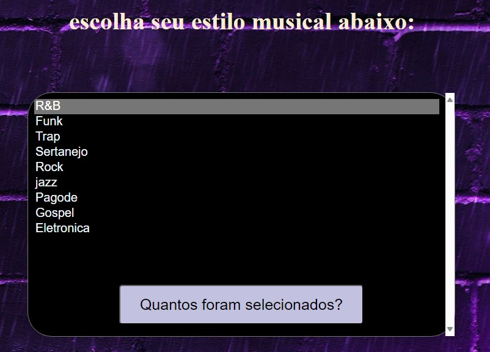

# catalogo_la-os_de_repeti-o

*Este é um código HTML, CSS e JavaScript que permite aos usuários criar vários tipos de músicas de sua escolha. Com esta aplicação, os usuários podem experimentar uma ampla variedade de estilos musicais e personalizar suas próprias composições de acordo com suas preferências.

# funcionalidades
### javaScript Função

* Validação de Entrada de Usuário: Para garantir que os usuários forneçam informações válidas ao criar suas músicas, o JavaScript pode ser usado para validar as entradas do usuário.
* Armazenamento Local: O JavaScript pode ser usado para armazenar as composições musicais criadas pelos usuários localmente no navegador, permitindo que eles as acessem posteriormente.
* Geração de Música: Dependendo da complexidade da aplicação, o JavaScript pode ser usado para gerar música com base nas escolhas e configurações dos usuários.

# ferramentas ultilizadas
* CSS
* vscode
* JavaScript
* git hub

# ultilidades

* Este código oferece uma solução flexível e facilmente adaptável para permitir que os usuários selecionem múltiplas opções a partir de uma lista suspensa. Embora tenha sido projetado inicialmente para tipos de música, ele pode ser facilmente personalizado para atender a uma variedade de propósitos diferentes. Para isso, basta modificar as opções na lista suspensa para refletir as escolhas desejadas para o usuário.

